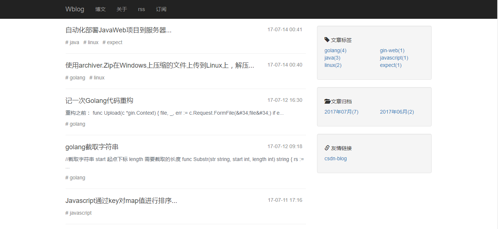
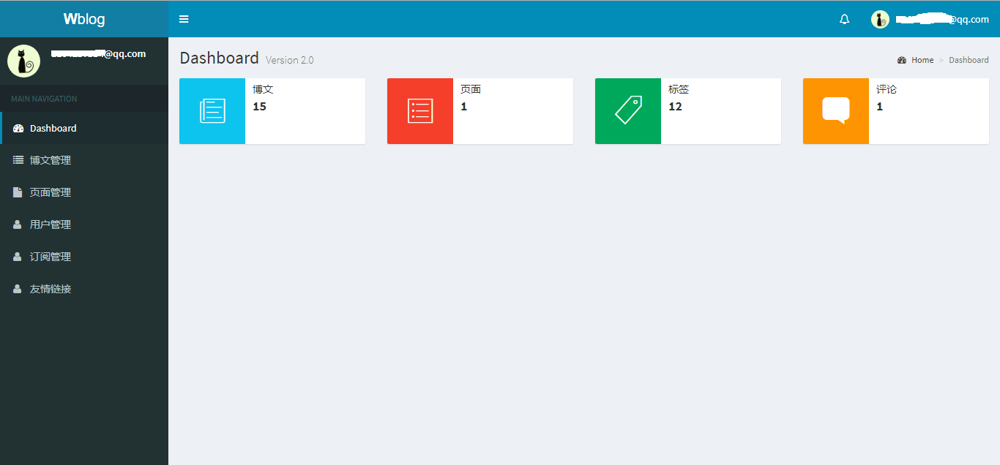

# wblog
[示例地址](http://67.216.221.230/)

## 初衷
作为一名web开发程序员居然没有自己的博客，都不好意思对外宣称自己的开发web的。
以前也有写博客的习惯，但是都是用的现有的博客网站。

## 技术选型
1. web:[gin](https://github.com/gin-gonic/gin)
2. orm:[gorm](https://github.com/jinzhu/gorm)
3. database:[sqlite3](https://github.com/mattn/go-sqlite3)
4. ~~全文检索:[wukong](https://github.com/huichen/wukong)~~
5. 文件存储:[七牛云存储](https://www.qiniu.com/)
6. 配置文件 [go-yaml](https://github.com/go-yaml/yaml)

## 项目结构
```
-wblog
    |-conf 配置文件目录
    |-controllers 控制器目录
    |-helpders 公共方法目录
    |-models 数据库访问目录
    |-static 静态资源目录
        |-css css文件目录
        |-images 图片目录
        |-js js文件目录
        |-libs js类库
    |-system 系统配置文件加载目录
    |-tests 测试目录
    |-vendor 项目依赖其他开源项目目录
    |-views 模板文件目录
    |-main.go 程序执行入口
```
## TODO
- [ ] 系统日志
- [ ] 网站统计
- [x] 文章、页面访问统计
- [x] github登录发表评论
- [x] rss
- [x] 定时备份系统数据
- [x] 邮箱订阅功能

## 安装部署
本项目使用govendor管理依赖包，[govendor](https://github.com/kardianos/govendor)安装方法
```
go get -u github.com/kardianos/govendor
```

```
git clone github.com/wangsongyan/wblog
cd wblog
govendor sync
go run main.go
```

## 使用方法
### 使用说明
1. 修改conf.yaml，设置signup_enabled: true
2. 访问http://xxx.xxx/signup 注册管理员账号
3. 修改conf.yaml，设置signup_enabled: false

### 注意事项
1. 如果需求上传图片功能请自行申请七牛云存储空间，并修改配置文件填写
    - qiniu_accesskey
    - qiniu_secretkey
    - qiniu_fileserver 七牛访问地址
    - qiniu_bucket 空间名称
2. 如果需要github登录评论功能请自行注册[github oauthapp](https://github.com/settings/developers)，并修改配置文件填写
    - github_clientid
    - github_clientsecret
    - github_redirecturl
3. 如果需要使用邮件订阅功能，请自行填写
    - smtp_username
    - smtp_password
    - smtp_host,例如：smtp.163.com:25

## 效果图





